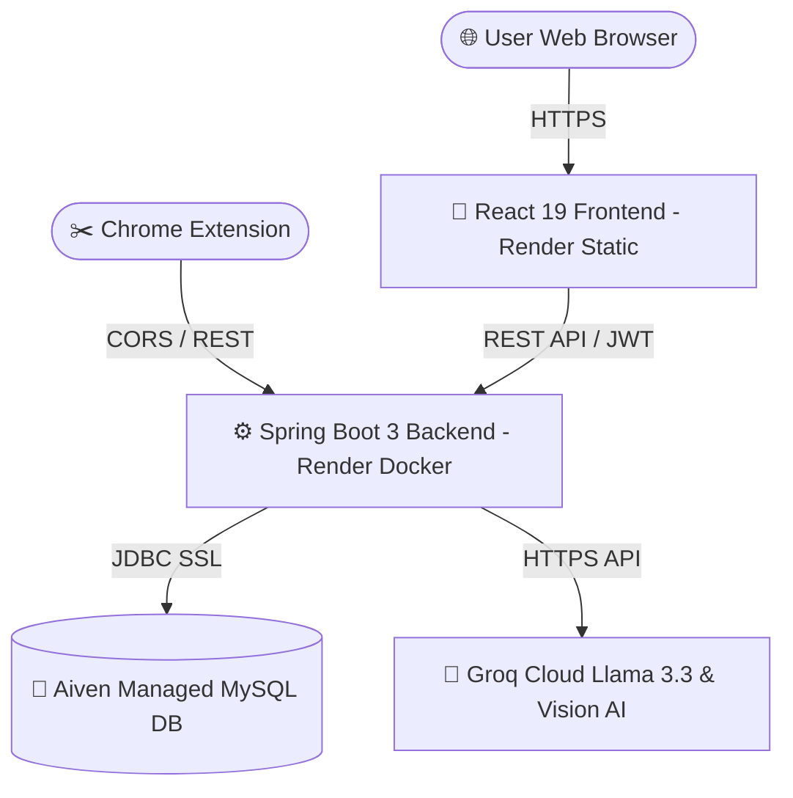

# 🧠 LifeOS — AI Personal Digital Brain

<div align="center">

  
  
  
  

  ### *Your Ultimate Command Center for Productivity, Knowledge, and Personal Growth*

  <p align="center">
    <a href="https://lifeos-frontend-qxsy.onrender.com/"><strong>🚀 View Live Application</strong></a> ·
    <a href="https://lifeos-backend-sh92.onrender.com/api/test/ping"><strong>⚡ Live API Endpoint</strong></a> ·
    <a href="https://github.com/iamcoolhimanshu/LifeOS"><strong>🐙 GitHub Repository</strong></a>
  </p>

</div>

---

## 🌟 Overview

**LifeOS** is an enterprise-grade, all-in-one AI-assisted personal digital brain and command dashboard designed to organize, track, and connect every facet of daily life into a unified interactive system.

From **OKR Goal Setting** and **Calendar Time-Blocking** to **Personal Finance**, **Skill Learning Matrix**, **AI Memory Vault**, and **Interactive Force-Directed Knowledge Graph**, LifeOS connects notes, tasks, ideas, documents, and schedules into a cohesive web application.

---

## 🚀 Key Modules & Capabilities

### 💻 1. Frontend Command Center (React 19 + TypeScript + Vite)
* **📊 Dashboard Summary:** Real-time metrics overview, daily habits tracking, active project checklists, and urgent schedule alerts.
* **🕸️ Interactive Knowledge Brain Graph:** Physics-based node graph dynamically visualizing semantic links between notes, tasks, goals, and documents in both dark and light modes.
* **📅 Interactive Schedule Calendar:** Time-blocking calendar with customizable color-coded categories, event creation modals, and high-contrast dark/light mode rendering.
* **🎯 OKR & Multi-Horizon Goals:** Objective tracking with key results meters, status tags, and progress tracking.
* **📈 Personal Finance Manager:** Income & expense ledger, savings goals, monthly budgets, and projected net worth calculations.
* **📚 Skill & Career Matrix:** Skill roadmap tracker, bookmarkable resources, interview preparation logs, and career milestones.
* **🔐 Configuration Vault:** Dynamic settings control panel allowing users to configure custom SMTP mail servers, Google OAuth keys, and Groq AI API keys safely.
* **📱 Responsive Mobile Simulator:** Built-in interactive device simulator testing responsive layout performance across screens.

### ⚙️ 2. High-Performance Backend REST API (Spring Boot 3.3.2 + Java 17)
* **🔒 Enterprise Security:** JWT token authentication (`JJWT`), role-based access control, session token refresh, and CORS filters supporting browser extensions & cloud domains.
* **🤖 AI Integration Engine:** Dynamic provider resolution (Groq Llama 3.3 70B & Vision Multi-modal OCR) with seamless fallback to local heuristic models.
* **📄 Document OCR & PDF Processing:** PDF text parsing via Apache PDFBox and image OCR text extraction.
* **📧 Dynamic SMTP Service:** Multi-tenant email dispatch using user-configured vault SMTP credentials or system mailers.
* **💾 Database Persistence:** Relational persistence powered by JPA/Hibernate and Aiven Managed MySQL 8.0 with Jackson proxy handling.

### 🔌 3. Browser Companion (Chrome Extension Manifest V3)
* **✂️ LifeOS Brain Clipper:** Browser extension allowing one-click web page clipping and notes saving directly from any browser tab into the user's LifeOS Digital Brain.

---

## 🏗️ System Architecture



---

## 🛠️ Technology Stack

| Domain | Layer / Framework | Purpose |
| :--- | :--- | :--- |
| **Frontend** | React 19, TypeScript, Vite | Fast Single Page Application (SPA) |
| | Tailwind CSS | Sleek utility styling & glassmorphism |
| | Zustand | Client state management & dark/light theme store |
| | Lucide React, Canvas API | Visual icons & physics-based knowledge graph |
| **Backend** | Spring Boot 3.3.2, Java 17 | Enterprise REST API |
| | Spring Security, JJWT | JWT token authentication & authorization |
| | JPA / Hibernate | Object-Relational Database Mapping |
| | Apache PDFBox | PDF document parsing & text extraction |
| **Database** | Aiven Managed MySQL 8.0 | Cloud relational persistence with SSL |
| **DevOps** | Docker, Render, Vercel | Containerized cloud deployment |
| **Browser Extension**| Chrome Extension Manifest V3 | Web page clipper popup |

---

## 🌐 Production Deployment Setup

LifeOS is live in production with a decoupled cloud infrastructure:

- **Frontend Application:** Hosted on **Render Static Site** at [https://lifeos-frontend-qxsy.onrender.com](https://lifeos-frontend-qxsy.onrender.com)
- **Backend API:** Hosted on **Render Docker Web Service** at [https://lifeos-backend-sh92.onrender.com](https://lifeos-backend-sh92.onrender.com)
- **Database:** Hosted on **Aiven Cloud Managed MySQL 8.0** (`sslmode=REQUIRED`)

### Environment Variables

#### Backend (`backend` Service)
```properties
SPRING_DATASOURCE_URL=jdbc:mysql://mysql-30c0d936-iamcoolhimanshu-3f13.d.aivencloud.com:12513/lifeos?sslmode=REQUIRED
SPRING_DATASOURCE_USERNAME=avnadmin
SPRING_DATASOURCE_PASSWORD=<YOUR_AIVEN_PASSWORD>
JWT_SECRET=404E635266556A586E3272357538782F413F4428472B4B6250645367566B5970
```

#### Frontend (`frontend` Service)
```properties
VITE_API_URL=https://lifeos-backend-sh92.onrender.com/api
```

---

## 💻 Local Development Guide

### Prerequisites
- **Node.js**: v18.0.0 or higher
- **Java JDK**: 17
- **MySQL**: 8.0 Server

### 1. Database Setup
```sql
CREATE DATABASE lifeos;
```

### 2. Backend Setup
```bash
cd backend
# Build and run the Spring Boot server
./mvnw clean install
./mvnw spring-boot:run
```
*Backend API boots at `http://localhost:8080`*

### 3. Frontend Setup
```bash
cd frontend
npm install
npm run dev
```
*Frontend dev server boots at `http://localhost:5173`*

---

## 🧩 Installing the Chrome Extension Clipper

1. Open Google Chrome and navigate to `chrome://extensions/`.
2. Enable **Developer mode** in the top-right corner.
3. Click **Load unpacked** in the top-left corner.
4. Select the `extension/` directory from this repository.
5. Pin the **LifeOS Brain Clipper** extension and clip web pages directly into your LifeOS Digital Brain.

---

## 📄 License & Attribution

Designed and developed by **Himanshu** ([@iamcoolhimanshu](https://github.com/iamcoolhimanshu)).  
*Proprietary and Confidential. All Rights Reserved.*
